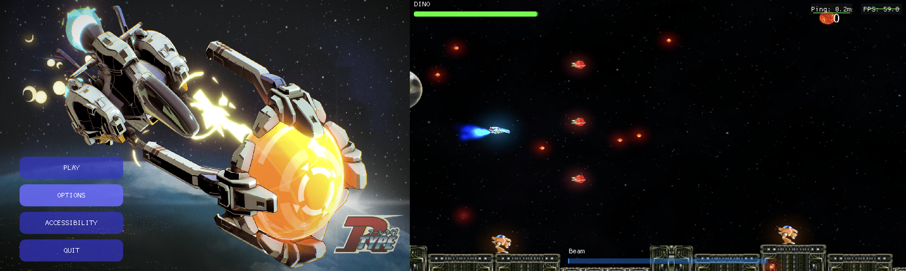

# R-Type Multiplayer Game Engine (ECS-based)
[](https://github.com/ManuelR-T/R-Type/actions/workflows/my_cppaction.yml)
[](https://github.com/ManuelR-T/R-Type/actions/workflows/doxygen-gh-pages.yml)
[](https://choosealicense.com/licenses/mit/)



## Table of Contents

- [Project Purpose](#project-purpose)
- [Requirements / Supported Platforms](#requirements--supported-platforms)
  - [Requirements](#requirements)
  - [Supported Platforms](#supported-platforms)
- [Usage Instructions](#usage-instructions)
  - [Download the Latest Release](#download-the-latest-release)
  - [Unzip the Downloaded File](#unzip-the-downloaded-file)
  - [Run the Binaries](#run-the-binaries)
- [License](#license)
- [Authors / Contacts](#authors--contacts)
- [Useful Links / Quick-Start Information](#useful-links--quick-start-information)

## Project Purpose

This project is a game engine built using an Entity-Component-System (ECS) architecture, offering scalability and flexibility for managing game objects and systems. Included around this engine is an existing implementation of the classic R-Type arcade game with a focus on multiplayer gameplay.

## Requirements / Supported Platforms
### Requirements:
There are no dependencies required for users as all necessary components are included in the release.

### Supported Platforms:
- Linux
- Windows

## Usage Instructions
To use the game engine and play the R-Type implementation, follow these steps:

### Download the Latest Release:
Visit the [Releases page](https://github.com/ManuelR-T/R-Type/releases) of this repository.
Download the appropriate zip file for your operating system (e.g., R-Type_Client_Windows.zip or R-Type_Server_Linux.zip).

### Unzip the Downloaded File:
- Windows:
    Right-click the downloaded .zip file and select "Extract All..."
- Linux:
    ```bash
    unzip R-Type_Server_Linux.zip -d R-Type_Server
    ```

### Run the Binaries:

- Client:
    ```bash
    ./r-type_client -i <server_ip> -p <server_port> -pn <player_name>
    ```
    - Example:
        ```bash
        ./r-type_client -i 127.0.0.1 -p 8080 -pn Player1
        ```

    - All arguments accepted:
        ```
        Available arguments:
        -i, --ip (string) [required] : Server IP address
        -p, --port (int) [required] : Server port
        -pn, --player_name (string) [required] : Player name
        -h, --help (bool) [optional] : Print this help message
        ```

- Server:
    ```bash
    ./build/r-type_server
    ```

## License

This project is licensed under the MIT License.
## Authors / Contacts

- [Thibaud Cathala](https://github.com/thibaudcathala)
- [Manuel Tomé](https://github.com/ManuelR-T)
- [Rahul Chander](https://github.com/RahulCHANDER25)
- [Nicolas Alexandre](https://github.com/Nicolasalx)


## Useful Links / Quick-Start Information

Entity-Component-System (ECS) explanation: https://en.wikipedia.org/wiki/Entity_component_system
