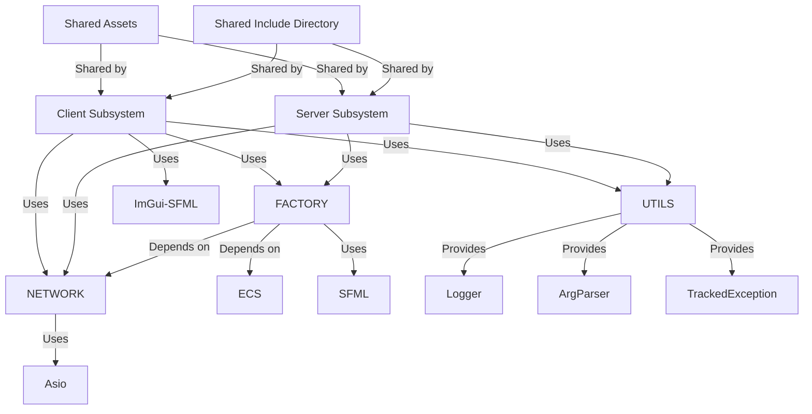
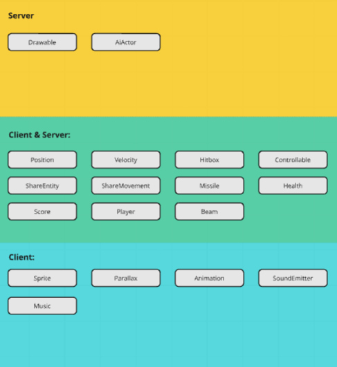

# Developer Documentation

## Introduction

This document provides an overview of the project to help new developers get acquainted with its structure and functionality. The focus is on practical information to understand the project broadly, rather than delving into the minutiae of the code. This documentation aims to provide a clear understanding of the project's architecture, main systems, and development guidelines.

## Architectural Overview

This project is built around an Entity-Component-System (ECS) architecture, which separates concerns into entities (game objects), components (data associated with entities), and systems (logic that processes entities with specific components). This provides flexibility and scalability, particularly important for managing the complexity of multiplayer game logic.

## Architectural Diagrams

- **Overview Diagram**:



- **Subsystem Diagrams**:



## Deep Dive

Don't hesitate to check the [doxygen documentation](https://manuelr-t.github.io/R-Type/) for more information.

## Tutorials and How-To’s

### Build the engine

#### Dependencies

To install the required dependencies on **Ubuntu** or any Debian-based system, run the following commands:

```bash
sudo apt update
sudo apt-get install -y \
  flex \
  bison \
  javacc \
  libflac-dev \
  libx11-dev \
  libxext-dev \
  libgl1-mesa-dev \
  libudev-dev \
  libopenal-dev \
  libvorbis-dev \
  libxcursor-dev \
  libxrandr-dev \
  libfreetype6-dev
```

#### Requirement

- C++20 or higher compiler
- CMake for build configuration (3.1 or higher)
- Network connectivity for multiplayer mode

#### Build

- Clone the repo

    ```bash
    git clone git@github.com:ManuelR-T/R-Type.git
    cd R-Type
    ```

- Generate build files using CMake:

    ```bash
    mkdir build
    cd build
    cmake ..
    ```

- Build the project:

    ```bash
    make
    ```

    Alternatively, you can build with:

    ```bash
    cmake --build .
    ```

And from now on you can follow the [Readme tutorial](../README.md#run-the-binaries) on how to use the binaries

### Mod the Game

- Modify a stage

    There is 10 stages in R-Type that can be found here: `assets/stages/`
    You can modify as you want to spawn other entity, at an other place etc...

### Mod the engine

- How to Add a New Entity

    Define the entity JSON:
    Add a new JSON file in the assets/ directory describing the entity's components, such as position, velocity, sprite, and more.

    Register the entity:
    Use the EntityFactory to register and create this entity in your game. For example:

    ```cpp
    entityFactory.createEntityFromJson("assets/new_entity.json");
    ```

- How to Modify Game Systems

    To modify or create a new system, follow these steps:

    1. Create a new system file in lib/factory/systems/.

    2. Define the system logic by processing entities with specific components. For example, in control_move.cpp:

        ```cpp
        for (auto [entity, position, velocity] : registry.view<Position, Velocity>()) {
            position.x += velocity.vx * delta_time;
            position.y += velocity.vy * delta_time;
        }
        ```

    3. Register the system so that it gets processed.
