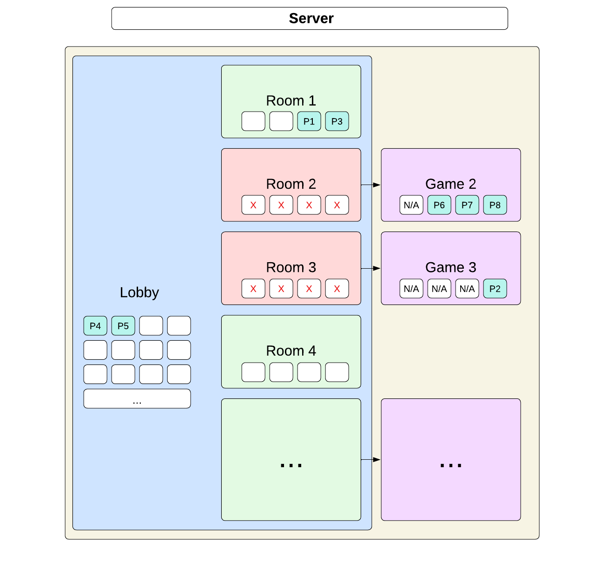
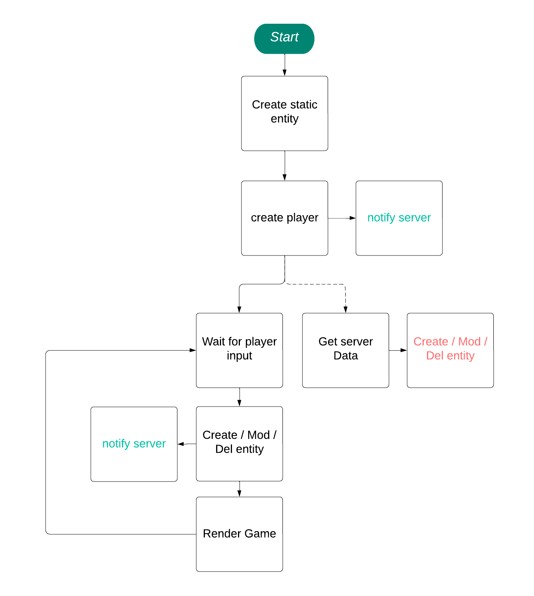
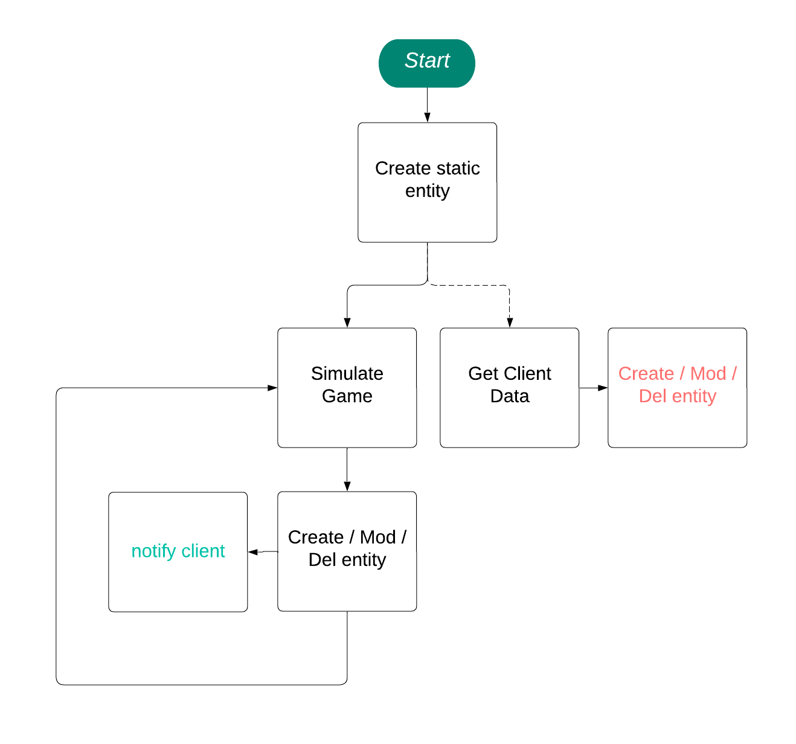

# Technical and Comparative Study

# Table of Contents

- [Introduction](#introduction)
- [Programming Language](#programming-language)
  - [C++](#c++)
  - [CMake](#cmake)
- [Graphics Library](#graphics-library)
  - [SFML](#sfml)
  - [ImGui](#imgui)
- [Networking Techniques](#networking-techniques)
  - [TCP](#tcp)
  - [Architecture of the rooms and lobby](#architecture-of-the-rooms-and-lobby)
  - [UDP](#udp)
  - [Using UDP for in game communication](#using-udp-for-in-game-communication)
  - [Asio](#asio)
- [Data Structures](#data-structures)
  - [Using ECS ​​Architecture](#using-ecs-architecture)
  - [Client algorithm](#client-algorithm)
  - [Server Algorithm](#server-Algorithm)
- [Storage](#storage)
  - [JSON](#storage)
  - [Using the nlohmann/json library](#using-the-nlohmann/json-library)
- [Data Security and Integrity](#data-security-and-integrity)

# Introduction

This document provides a comparative study of the technologies employed in the project, focusing on programming languages, graphics libraries, algorithms, networking techniques, and more.

The goal is to justify the choice of each technology based on their relevance and effectiveness in addressing the project's requirements.

# Programming Language

## C++

For our project inspired by **R-Type**, we chose to use **C++** as the primary programming language.

This strategic choice is based on the performance, flexibility, and resource management requirements necessary to develop a quality video game.

### Use Cases

C++ has been used in several aspects of our project:

- **Game Engine**:
  Development of the game engine to manage game loops, user inputs, and game logic.

- **Entity Management**:
  Implementation of the ECS (Entity-Component-System) architecture to manage entities and their behaviors in a modular and efficient manner.

- **Graphics and Rendering**:
  Integration of libraries like SFML for graphical rendering and resource management, allowing for real-time graphics display.

### Advantages

- **High Performance**:
  C++ is known for its speed and efficiency, providing optimal performance essential for video game development.

- **Memory Control**:
  Manual memory management allows for optimization of resource usage and ensures low latency.

- **Object-Oriented Programming**:
  C++ enables the use of object-oriented programming concepts, promoting code reuse and modularity.

- **Rich Ecosystem**:
  With a wide range of libraries and tools, C++ facilitates the integration of advanced features and enhances development.

### Disadvantages

- **Complexity**:
  C++ can be more complex to master than other languages, especially for novice developers, due to its syntax and advanced concepts (like memory management).

- **Development Time**:
  C++ projects may require more time for implementation and debugging due to this complexity.

### Comparison

| Feature               | C++                                                                                                      | Python                                                                                                   | Java                                                                                                   |
|-----------------------|----------------------------------------------------------------------------------------------------------|----------------------------------------------------------------------------------------------------------|--------------------------------------------------------------------------------------------------------|
| **Performance**       | Very high performance, ideal for applications requiring precise resource control                         | Less performant than C++ due to interpreter, but sufficient for most applications                         | High performance through JVM, but generally slower than C++                                            |
| **Memory Management** | Manual management (pointers), offering fine control but high risk of errors                              | Automatic memory management (garbage collection), easier to manage but with less control                  | Automatic management (garbage collection), offering a good balance between control and simplicity      |
| **Ease of Learning**  | Complex to learn, with strict syntax and advanced concepts (pointers, templates, etc.)                   | Easy to learn, with simple and intuitive syntax, popular for beginners                                   | Relatively easy, with a faster learning curve than C++                                                |
| **Ecosystem**         | Large ecosystem with many libraries for game development, systems, etc.                                 | Extensive ecosystem for web development, scripting, data science, and AI                                 | Large ecosystem for enterprise applications, with robust cross-platform support                        |
| **Object-Oriented**   | Yes, with advanced support for polymorphism, inheritance, and encapsulation                              | Yes, but without advanced C++ concepts                                                                   | Yes, with a complete implementation of object-oriented programming                                     |
| **Use Cases**         | Game development, operating systems, embedded applications                                              | Scripting, web applications, data science, AI                                                            | Enterprise applications, Android applications, distributed systems                                    |
| **Disadvantages**     | High complexity, manual memory management, and frequent compile-time errors                             | Less performant, can lead to memory overuse                                                             | Requires JVM, less control over memory, and can be verbose                                            |

### Conclusion

Using **C++** for the development of our R-Type inspired game has allowed us to leverage its many features and advantages.
This language offers the performance, flexibility, and control necessary to achieve an ambitious video game project.
Despite some drawbacks related to its complexity, the benefits far outweigh the challenges, making C++ a wise choice for our development.

---

## CMake

In our project inspired by **R-Type**, we chose **CMake** as the main tool for compiling and managing the configuration of our application.

This choice was motivated by the need to ensure efficient compilation and portability across different platforms.

### Use Cases

CMake has been used in several aspects of our project:

- **Build Management**:
  CMake automates the compilation process of our C++ code and manages dependencies between files.

- **Cross-Platform Configuration**:
  CMake allows generating project files suitable for different development environments (Visual Studio, Makefiles, etc.), thus facilitating compilation on various platforms (Windows, macOS, Linux).

- **Library Integration**:
  CMake simplifies the integration and configuration of third-party libraries used in the project, such as SFML and ImGui.

### Advantages

- **Cross-Platform**:
  CMake enables the development of applications that can be compiled on multiple operating systems without major changes to the source code.

- **Ease of Use**:
  With a simple and intuitive scripting language, CMake makes project management easier, even for novice developers.

- **Dependency Management**:
  CMake simplifies the inclusion of external libraries and manages dependencies effectively, reducing the risk of errors during compilation.

- **Flexibility**:
  CMake offers great flexibility in configuring build options, allowing adaptation of the project to specific user needs.

### Disadvantages

- **Initial Complexity**:
  Although CMake is powerful, its initial configuration can be complex, especially for large projects with many dependencies.

- **Variable Documentation**:
  The quality of documentation can vary, making some features difficult to grasp for new users.

- **Dependency on CMake**:
  Developers must install CMake to compile the project, which can add an extra step in the configuration process.

### Comparison

| Feature               | CMake                                                                                                    | Make                                                                                                     | Meson                                                                                                  |
|-----------------------|----------------------------------------------------------------------------------------------------------|----------------------------------------------------------------------------------------------------------|--------------------------------------------------------------------------------------------------------|
| **Cross-Platform**    | Yes, supports Windows, macOS, Linux, and generates platform-specific project files (e.g., Visual Studio) | Primarily for Unix-based systems, less effective on Windows                                             | Yes, designed to be cross-platform, supporting Windows, macOS, Linux                                  |
| **Ease of Use**       | Moderate, with a scripting language that can be complex for larger projects                              | Simple syntax, but can be cumbersome to handle dependencies and complex projects                          | Very user-friendly syntax, designed to be easy for developers                                         |
| **Dependency Management** | Effective at managing dependencies, including third-party libraries (e.g., SFML, ImGui)              | Limited, dependencies must often be managed manually                                                      | Excellent dependency handling with built-in support for packages like pkg-config                      |
| **Flexibility**       | Highly flexible with extensive configuration options                                                     | Limited flexibility, especially for complex or multi-platform builds                                     | Flexible and modern, with good support for custom configurations                                      |
| **Performance**       | Efficient, with support for parallel builds and complex configurations                                   | Can be slow on larger projects, lacks native parallelization                                             | Fast build process, designed to optimize speed and performance                                        |
| **Learning Curve**    | Moderate to steep, especially for beginners                                                              | Easy for small projects, but complex for larger ones                                                     | Low learning curve, intuitive and well-documented                                                     |
| **Use Cases**         | Ideal for cross-platform C++ projects, embedded systems, game development                                | Suitable for Unix-based, smaller projects where cross-platform support is not a priority                 | Great for both small and large projects, particularly where cross-platform support is required        |
| **Disadvantages**     | Initial setup can be complex; requires CMake installation                                                | Limited to Unix systems without extra tools; challenging to manage complex dependencies                  | Requires Python for installation; some features still in development                                  |

### Conclusion

Using **CMake** for the compilation and management of our R-Type inspired project has been a strategic decision aimed at ensuring optimal portability and flexibility.
CMake has allowed us to automate the compilation process, manage dependencies effectively, and facilitate cross-platform development.
The advantages of CMake make it a wise choice for our project, ensuring a smooth and efficient development experience.

# Graphics Library

## SFML

For the graphical development of our R-Type inspired game, we opted for **SFML** (Simple and Fast Multimedia Library). This choice was motivated by several advantages, including its ease of use, high performance, and wide range of features suited for game development.

### Why SFML?

**SFML** is a multimedia library that facilitates the management of graphics, sound, user inputs, and much more. It is particularly well-suited for video games due to its simple and efficient architecture, allowing developers to create graphical applications in C++ without having to manage complex low-level details.

### Use Cases in Our Project

We used SFML for the following elements:

- **Graphics Display**:
  SFML allowed us to easily load and display sprites, backgrounds, and other essential graphical elements for the game. Its 2D rendering system is optimized to provide smooth and responsive performance, which is crucial for a dynamic shoot'em up.

- **Event Management**:
  The SFML library offers a simple and efficient event management system, facilitating the detection of user inputs, such as player movements, shooting, and interactions with the interface.

- **Sound and Music**:
  SFML also allows for sound and music management, enriching the gaming experience by adding sound effects and an immersive soundtrack.

#### Advantages of SFML

- **Ease of Use**:
  SFML has a user-friendly and intuitive interface, allowing developers to focus on creating their game rather than the complexity of low-level APIs.

- **Comprehensive Documentation**:
  The library is well-documented, with clear examples and guides, making learning and integration easier.

- **High Performance**:
  SFML is designed to be performant, utilizing advanced optimization techniques to ensure high refresh rates, even in graphically intense scenarios.

- **Cross-Platform Support**:
  SFML works on multiple platforms (Windows, Linux, macOS), allowing for the development of portable games without modifying the code.

### Limitations of SFML

- **Limited Features for 3D Games**:
  While SFML excels at developing 2D games, it offers fewer features for managing 3D graphics, which could be a constraint if we consider evolving towards three-dimensional games.

- **Lack of High-Level Features**:
  SFML focuses on providing low-level tools, meaning that some advanced features may require additional development or the integration of other libraries.

### Comparison
| Feature                   | SFML                                                                                                      | SDL (Simple DirectMedia Layer)                                                                          | Allegro                                                                                               |
|---------------------------|----------------------------------------------------------------------------------------------------------|---------------------------------------------------------------------------------------------------------|-------------------------------------------------------------------------------------------------------|
| **Ease of Use**           | User-friendly and intuitive API; ideal for beginners and small to medium game projects                   | Moderate complexity; larger learning curve but widely documented                                        | Beginner-friendly API, with a good balance between simplicity and flexibility                         |
| **2D Graphics**           | Strong 2D support with efficient rendering, great for shoot 'em ups and other 2D games                   | Good 2D support but requires additional work to achieve effects like transparency                        | Excellent 2D support, optimized for game development with built-in functions                          |
| **3D Graphics**           | Limited 3D support, primarily designed for 2D applications                                               | Limited native support; requires OpenGL for 3D capabilities                                             | Limited 3D support, though possible with integrations                                                 |
| **Sound & Music**         | Built-in audio module, simplifying sound effect and music integration                                    | Audio support via SDL_mixer or third-party libraries                                                     | Built-in sound support, with support for various formats                                              |
| **Cross-Platform Support**| Works on Windows, Linux, and macOS seamlessly                                                            | Cross-platform support across a wide range of systems, including Windows, Linux, macOS, and consoles    | Cross-platform support on Windows, Linux, macOS, with additional options for mobile                   |
| **Documentation**         | Extensive documentation with examples, tutorials, and community support                                  | Large documentation base with many resources and tutorials                                              | Comprehensive documentation and an active developer community                                         |
| **Performance**           | High performance, with optimizations for smooth 2D rendering                                             | High performance but requires additional setup for optimal resource usage                               | High performance, especially optimized for 2D games                                                   |
| **Use Cases**             | Ideal for 2D games, GUI applications, and media-focused projects                                         | Widely used in game engines, emulators, and multimedia applications                                     | Best for 2D games, media playback, and simpler game projects                                          |
| **Limitations**           | Limited 3D capabilities, lacks high-level game development features                                       | Requires add-ons for advanced functionality; some features may require OpenGL                            | Limited built-in support for networking and 3D, requiring extra work for complex applications         |

### Conclusion

Using SFML for the graphical display of our prototype has proven to be a wise choice. Its simplicity, performance, and flexibility have allowed us to create an immersive and dynamic gaming experience while focusing on gameplay mechanics and creative design.

SFML perfectly meets our current needs, offering a robust and effective solution for the development of our game.

---

## ImGui

For the graphical interface development of our R-Type inspired game, we chose to use **ImGUI** (Immediate Mode GUI). This choice was motivated by several advantages, including rapid development, flexibility, and easy integration with graphics engines.

### Why ImGUI?

**ImGUI** is a graphical user interface library that operates on the principle of Immediate Mode, allowing for the creation of dynamic and responsive user interfaces. It is lightweight, easy to integrate, and offers a great degree of customization, making it an excellent choice for video games and development tools.

### Use Cases in Our Project

We used ImGUI to create the following interface elements:

- **Heads-Up Display (HUD)**:
  The HUD of the game, which displays essential information such as the score, remaining lives, and player status, was developed with ImGUI, providing a smooth and immersive user experience.

- **Lobby and Game Rooms**:
  ImGUI was used to create the lobby interface, allowing players to group together and select rooms before starting a game. This interface is intuitive and responsive, facilitating navigation and interaction among players.

### Advantages of ImGUI

- **Rapid Development**:
  ImGUI allows for the quick and efficient creation of user interfaces, reducing development time and enabling a focus on game features.

- **Ease of Integration**:
  ImGUI can be easily integrated into various graphics engines, making it versatile for different development projects.

- **Flexibility and Customization**:
  ImGUI offers a high degree of customization, allowing developers to design interfaces tailored to their specific needs without constraints.

- **Simplicity of Use**:
  The simple and intuitive syntax of ImGUI makes it easy to create interface elements, making the library accessible even for less experienced developers.

### Limitations of ImGUI

- **Not Optimized for Complex Interfaces**:
  While ImGUI is excellent for simple and dynamic interfaces, it can become less suitable for more complex user interfaces that require advanced state management and hierarchization.

- **Dependence on the Rendering Loop**:
  Since ImGUI operates in immediate mode, each interface element must be redrawn every frame, which can pose performance issues in heavily loaded scenarios.

### Comparison

| Feature                       | ImGUI                                                                                                             | Qt                                                                                                   | Dear ImGui                                                                                              |
|-------------------------------|-------------------------------------------------------------------------------------------------------------------|------------------------------------------------------------------------------------------------------|---------------------------------------------------------------------------------------------------------|
| **Ease of Use**               | Straightforward and intuitive syntax; accessible for beginners with simple APIs                                  | Comprehensive but complex; has a steeper learning curve due to its extensive feature set             | Similar to ImGUI; easy for immediate-mode interfaces but requires more setup for detailed customization |
| **UI Mode**                   | Immediate Mode, which allows for real-time, dynamic updates                                                      | Retained Mode, ideal for applications needing complex and static UIs                                | Immediate Mode; real-time updates, best for game tools and prototyping                                   |
| **Cross-Platform Support**    | Integrates with most graphics engines and works across major OS platforms                                        | Broad support across all major OS, including mobile platforms                                       | Cross-platform, though optimized mainly for desktop applications                                       |
| **Customization**             | Highly customizable, flexible layouts but more manual coding needed                                              | Extensive built-in customization options and widgets                                                | Highly customizable, ideal for custom styling and layout management                                     |
| **Performance**               | Fast rendering for dynamic UIs but may consume resources in highly loaded scenarios due to frame-by-frame redrawing | Highly optimized for desktop applications; performance varies with mobile                            | High performance for real-time use cases but dependent on rendering backends                            |
| **Use Cases**                 | Ideal for in-game HUDs, debugging tools, and development dashboards                                              | Broad applications from desktop to mobile, including enterprise software                             | Great for game development tools, HUDs, and development dashboards                                      |
| **Limitations**               | Limited for complex state management and extensive hierarchical interfaces                                        | Heavier setup and more complex integration; slower for immediate-mode needs                         | Less suitable for highly complex UIs due to its minimal state handling                                  |
| **Documentation**             | Good documentation, with a solid community and examples                                                          | Extensive and widely supported documentation, plus active community                                 | Strong community support, with comprehensive examples and resources available                           |

### Conclusion

Using the ImGUI library for the graphical interface of our prototype has proven to be a strategic and effective choice. Its rapid development, flexibility, and ease of integration have allowed us to create an engaging and responsive user interface while maintaining a high level of performance.

ImGUI perfectly meets our current needs, offering a dynamic and intuitive solution that enriches the user experience and simplifies the development process.

## Networking Techniques

## TCP

TCP (Transmission Control Protocol) is a communication protocol used on the Internet and in many private networks. It is part of the TCP/IP protocol suite and operates above the IP (Internet Protocol) layer. Its main role is to ensure reliable data transmission between two machines connected to the network.

### How TCP Works

The TCP protocol relies on several mechanisms to ensure reliable and ordered communication between a client and a server:

- **Connection Establishment**:
  Before data can be exchanged, TCP establishes a connection between the two parties through a three-step process called the handshake.

- **Reliable Transmission**:
  TCP guarantees that all data sent by the client arrives in order and without errors at the server.

- **Flow Control**:
  TCP dynamically adjusts the amount of data sent based on the recipient's capacity to receive it, to avoid overwhelming the recipient.

- **Connection Termination**:
  Once the transmission is complete, TCP closes the connection cleanly through a defined process.

### Advantages of TCP

- **Reliability**:
  TCP ensures that all transmitted data arrives at its destination without errors, in the correct order, and without duplication.

- **Flow and Congestion Control**:
  TCP dynamically adjusts the amount of data sent to adapt to network conditions.

- **Ordered Transmission**:
  Data segments are reassembled in the correct order by the receiver, even if the packets arrive out of order.

- **Automatic Error Recovery**:
  If data segments are lost or corrupted during transmission, TCP ensures that they are retransmitted.

### Comparison

| Feature                    | TCP (Transmission Control Protocol)                                               | SCTP (Stream Control Transmission Protocol)                  |
|----------------------------|-----------------------------------------------------------------------------------|--------------------------------------------------------------|
| **Connection Type**        | Connection-oriented; requires a three-way handshake                               | Connection-oriented; supports multihoming and multi-streaming |
| **Reliability**            | Reliable transmission with error-checking, sequencing, and retransmission         | Reliable, with error-checking, sequencing, and retransmission |
| **Flow and Congestion Control** | Yes, adjusts data flow based on network and receiver's capacity              | Yes, supports advanced flow and congestion control           |
| **Ordering of Messages**   | Guaranteed in-order delivery                                                     | Guaranteed in-order delivery within streams                  |
| **Transmission Speed**     | Moderate speed due to overhead from error-checking and flow control               | Generally faster due to efficient multi-stream handling      |
| **Ideal Use Cases**        | File transfers, web browsing, email (where reliable delivery is crucial)          | Telecommunications, VoIP, and applications needing both reliability and low latency |
| **Error Handling**         | Retransmits lost packets and verifies data integrity                             | Built-in error handling with retransmission for lost packets |
| **Multi-Streaming**        | No support; data follows a single stream                                         | Yes, supports multiple streams within a single connection   |
| **Multihoming Support**    | No, typically binds to a single IP address                                       | Yes, allows multiple IP addresses per endpoint               |
| **Resource Efficiency**    | Higher resource use due to state maintenance and control mechanisms               | Higher resource use but optimized for telecom applications    |

## Architecture of the Rooms and Lobby

The diagram below illustrates the player management structure in the game server, comprising several rooms and a lobby. This architecture has been designed to efficiently handle player connections and interactions within the game. Here is a detailed explanation of the key components and how they function:

### 1. Lobby

The lobby is the welcome area where players can gather before joining a game room.
It allows players to connect, chat, and choose the room they want to enter.
Players can also see who is online (e.g., P4, P5) and select their room.

### 2. Rooms

Each room is a dedicated space for gameplay.
The rooms (Room 1, Room 2, Room 3, Room 4, etc.) allow players to compete in matches.
Each room can accommodate multiple players (P1, P2, P3, etc.) and has its own game logic. Rooms are configurable for specific games, allowing flexibility in the type of game offered.

### 3. Game Management

Next to the rooms, the server can create games (Game 2, Game 3, etc.) where players are assigned to specific teams.
This allows for multiple games to be managed simultaneously, isolating players in different rooms.

### 4. Communication via TCP

This architecture has been implemented using the TCP (Transmission Control Protocol) for the following reasons:

- **Reliability**:
  TCP guarantees the delivery of data packets in the correct order.
  This is essential in a gaming environment where every action and movement of players must be correctly synchronized and received.

- **Flow and Congestion Control**:
  TCP automatically adjusts the data transmission rate between the server and clients, which is crucial for maintaining a smooth gaming experience, even if the network is congested.

- **Persistent Connection**:
  With TCP, a connection is established between the client and server until one side decides to close it.
  This facilitates continuous interactions, such as real-time updates of player states in the lobby and rooms.

### Conclusion

The architecture of the rooms and the lobby, implemented with TCP, provides a robust and effective solution for managing player interactions in the game.
It ensures smooth and reliable communication, which is essential for an immersive and dynamic gaming experience.

---

## UDP

UDP (User Datagram Protocol) is a communication protocol used on the Internet for the fast sending of messages or **datagrams** without guarantees of delivery or order.
Unlike TCP, UDP is a **connectionless** transport protocol, meaning it does not establish a connection before sending data.

It is part of the **TCP/IP** protocol suite, like TCP, but UDP stands out for its simplicity and efficiency in certain situations, particularly where speed and low latency are prioritized over reliability.

### **Principle of Operation of UDP**

UDP is designed to be fast and lightweight.
It lacks the complex connection management and reliable transmission mechanisms of TCP, which helps reduce delays and network overhead:

- **Direct Packet Sending**:
  Unlike TCP, UDP does not perform a connection step. Data (datagrams) are simply sent from one point to another without confirmation of receipt.

- **Absence of Reliability Mechanism**:
  UDP does not guarantee that data reaches its destination, and packets may be lost, duplicated, or arrive out of order without any correction.

- **Unordered Transmission**:
  Since there is no segmentation numbering like in TCP, UDP does not guarantee that datagrams arrive in the order they were sent.

- **No Flow or Congestion Control**:
  Unlike TCP, UDP does not regulate data flow or account for network congestion, making it faster but riskier in case of network overload.

### **Advantages of UDP**

- **Speed**:
  Since there is no prior connection step or reliable transmission management mechanism, UDP is much faster than TCP.
  It is ideal for applications where latency must be minimized, such as online gaming, VoIP calls, or live streaming.

- **Low Overhead**:
  UDP generates very little header overhead, as it does not need to manage mechanisms like acknowledgments or segment numbering.
  This allows for a high data throughput.

- **Non-blocking Transmission**:
  UDP does not wait for confirmation from the recipient to continue sending data, making it non-blocking and avoiding retransmission delays that can slow down exchanges.

### Comparison

| Feature                     | UDP (User Datagram Protocol)                                | SCTP (Stream Control Transmission Protocol)                 |
|-----------------------------|------------------------------------------------------------|-------------------------------------------------------------|
| **Connection Type**         | Connectionless; no need for a prior connection             | Connection-oriented; establishes a connection before data transmission |
| **Reliability**             | Unreliable; no guarantees of delivery, order, or duplication handling | Reliable; ensures data delivery with retransmission mechanisms and checks |
| **Flow Control**            | No flow control; sends data regardless of network conditions | Yes; manages data flow to avoid congestion and packet loss   |
| **Ordering of Messages**    | No ordering; packets may arrive out of sequence             | Ordered delivery; maintains the sequence of messages within each stream |
| **Transmission Speed**      | High speed due to minimal overhead                          | Moderate speed; reliability and ordering mechanisms introduce some latency |
| **Ideal Use Cases**         | Real-time applications like online gaming, VoIP, live streaming | Telephony signaling, multimedia applications, and any scenario needing multiple streams |
| **Error Handling**          | No error handling; losses are not corrected                 | Includes error detection and retransmission of lost packets  |
| **Header Size**             | Smaller; minimal header overhead                            | Larger; includes fields for stream management and control     |
| **Resource Efficiency**     | Low resource use; minimal state management                  | Moderate resource use due to its additional features          |
| **Transmission Mode**       | Non-blocking; does not wait for acknowledgment              | Blocking; may wait for acknowledgments to ensure reliability   |

## Using UDP for in game communication

In the context of our game, we chose to use UDP for communication between the client and the server due to the characteristics mentioned above, which perfectly match the needs of a dynamic and responsive application.
Here’s how this is reflected in our architecture:

- **Real-Time Event Transmission**:
  UDP allows for the rapid sending of datagrams containing critical information about player actions, such as movements, attacks, or state changes.
  This approach ensures that players receive game state updates almost instantly, which is essential for maintaining immersion and responsiveness in a gaming environment.

- **Latency Management**:
  By using UDP, we minimize communication delays.
  Each action from a player is immediately transmitted to the server without waiting for confirmations.
  This is particularly important during real-time competitions, where every millisecond counts.

- **Bandwidth Efficiency**:
  Due to the low overhead of UDP, we can send more information with less data.
  This frees up bandwidth for other operations while maintaining a high throughput for game-related information.

- **Game Data Updates**:
  Information regarding player states, scores, and environmental changes is sent via UDP.
  While we accept that some packets may be lost or arrive out of order, the gaming experience remains fluid.
  Essential data, such as player positions, is regularly updated to ensure that the game stays synchronized, even if some packets are occasionally missing.

- **Tolerance for Packet Loss**:
  The game is designed to be tolerant of packet loss, which is an inherent characteristic of UDP.
  The game mechanics are robust enough to handle missing information without harming the overall player experience.

### **Conclusion**

Using UDP for communication between the client and server of our game allows us to achieve optimal performance.
By quickly sending critical information and reducing latency, we have created a smooth and dynamic gaming experience that meets the demands of real-time games.
This approach enables us to leverage the advantages of UDP while intelligently managing the risks associated with its unreliable nature.

## Asio

For network communication in our **R-Type** inspired project, we chose to use **Asio**, a C++ library that allowed us to implement **TCP** and **UDP** protocols efficiently.

Asio was essential in establishing smooth communication between the client and server.

### Use Cases

Asio was utilized in several aspects of our project:

- **Client-Server Communication**:
  With Asio, we were able to establish TCP and UDP connections between the client and the server, enabling real-time data exchange.

- **Event Management**:
  Asio facilitates asynchronous I/O management, allowing us to handle network connections efficiently without blocking the rest of the program.

- **Data Transmission**:
  Asio manages data transfer, ensuring that messages are sent and received correctly, whether via TCP or UDP.

### Advantages

- **Performance**:
  Asio is designed to be performant and lightweight, which is crucial for a real-time game where latency must be minimized.

- **Support for Multiple Protocols**:
  Asio allows for easy handling of multiple network protocols (TCP and UDP), providing the flexibility needed to adapt our network architecture to the game’s requirements.

- **Asynchronous by Nature**:
  The asynchronous management of connections frees up resources and enhances the responsiveness of the application, which is essential for a dynamic gaming environment.

- **Documentation and Community**:
  Asio benefits from good documentation and an active community, making it easier to troubleshoot issues and learn its features.

### Disadvantages

- **Error Management Complexity**:
  Error handling in an asynchronous environment can be more complex, requiring special attention to ensure that exceptions are properly managed.

- **Initial Setup**:
  Setting up Asio and integrating it into the project may require additional effort compared to simpler solutions.

### Comparison

| Feature                           | Asio                                                     | Boost.Asio                                              |
|-----------------------------------|----------------------------------------------------------|--------------------------------------------------------|
| **Library Type**                  | Standalone library; does not depend on other libraries   | Part of the Boost C++ Libraries; requires Boost to use  |
| **Installation**                  | Simpler installation as a single header-only library    | More complex due to the need to install the entire Boost library |
| **Support for Multiple Protocols**| Supports TCP and UDP; designed for network programming   | Supports TCP, UDP, and other protocols; extensive network features |
| **Performance**                   | High-performance, lightweight for real-time applications  | Similar performance; optimized for various networking tasks |
| **Asynchronous Operations**       | Built-in support for asynchronous I/O                     | Excellent asynchronous support; widely used for network programming |
| **Error Handling**                | Manual error handling; may require additional management   | Integrated error handling with Boost's error categories |
| **Documentation**                 | Good documentation, but less extensive than Boost        | Extensive documentation and a large community for support |
| **Flexibility**                   | Flexible for network communication in games and real-time apps | Highly flexible, suitable for a wide range of applications beyond networking |
| **Dependencies**                  | Minimal dependencies; lightweight                         | Relies on the Boost framework, which may add complexity |
| **Learning Curve**                | Moderate learning curve for beginners                      | Steeper learning curve due to the vast number of features in Boost |

### Conclusion

The use of **Asio** to manage our **TCP** and **UDP** protocols was a crucial strategic choice in the development of our R-Type inspired project.
Asio enabled us to establish effective communication between the client and server while ensuring asynchronous management of connections.
The advantages of Asio in terms of performance, flexibility, and protocol support make it an ideal solution for our game's needs.

# Data Structures

## Using ECS ​​Architecture

In the development of our **R-Type** inspired project, we adopted the **Entity-Component-System (ECS)** architecture.
This approach allowed us to create a robust and flexible game engine, facilitating the development and extension of game features.

### Use Cases

The ECS architecture was implemented in several key aspects of our project:

- **Entity Management**:
  Each game object (players, enemies, items) is represented as an entity, allowing for a clear separation of different entities within the game world.

- **Modular Components**:
  The characteristics of entities are defined by components, enabling us to easily add or modify functionalities without affecting other parts of the code.

- **Processing Systems**:
  Systems are responsible for the game logic, processing entities based on their components, which allows for efficient updating and rendering of game elements.

### Advantages

- **Flexibility**:
  The ECS architecture allows for the addition of new entities and behaviors without requiring significant changes to the existing code, which is essential for rapid iteration during development.

- **Reusability**:
  Components can be reused across different entities, reducing redundancy and simplifying resource management.

- **Performance**:
  By separating data and logic, the ECS architecture can improve performance by allowing specific optimizations, such as parallel processing of systems.

- **Code Clarity**:
  The clear structure of ECS helps organize the code, making development and maintenance simpler and more understandable.

### Disadvantages

- **Initial Complexity**:
  Setting up an ECS architecture can be complex, particularly for developers who are not familiar with this model.

- **Management Overhead**:
  Managing entities, components, and systems can introduce overhead, especially in smaller projects where a simpler approach might suffice.

### Comparison

| Feature                           | Entity-Component-System (ECS)                                | Model-View-Controller (MVC)                               | Component-Based Architecture                              |
|-----------------------------------|---------------------------------------------------------------|----------------------------------------------------------|----------------------------------------------------------|
| **Basic Concept**                 | Separates entities, components, and systems for flexible game development | Separates application logic, user interface, and input handling | Composes objects from reusable components                  |
| **Entity Management**             | Entities represent game objects with unique IDs              | Models represent data, views represent UI, controllers handle user input | Entities can be composed from various components          |
| **Data Management**               | Components hold data, processed by systems                    | Models hold data, views present it, controllers manage input | Components are self-contained, can hold both data and behavior |
| **Code Organization**             | Highly modular and organized, enhancing code clarity         | Clear separation of concerns, promoting maintainability    | Allows for high modularity and reusability                |
| **Performance**                   | Optimizes performance through data-oriented design and parallel processing | Performance can be impacted by tight coupling between components | May offer good performance but depends on component interaction |
| **Flexibility and Reusability**   | Highly flexible, allows for dynamic addition of behaviors     | Moderate flexibility; changes in one part may affect others | High reusability; components can be reused across different entities |
| **Initial Complexity**            | Complex setup; may require significant initial investment     | Easier to understand and implement for simpler applications | Can be complex if components are not well-defined        |
| **Use Cases**                     | Best for games with many dynamic entities and behaviors       | Suitable for applications with clear user interaction      | Good for modular applications where entities share behaviors |

### Conclusion

The adoption of the **ECS** architecture in our project was crucial in creating an efficient and modular game engine.
This approach allowed us to easily manage the increasing complexity of the game while maintaining the flexibility needed for expansion and iteration.
The advantages in terms of performance, reusability, and code clarity make ECS an ideal solution for our game development.

## Client algorithm

The client algorithm is essential for managing player interactions with the game.
It ensures the creation and management of game entities while maintaining communication with the server. Here is a detailed explanation of each step of the algorithm:

### 1. Startup

- **Start**
  The process begins here, initiating the subsequent steps.

### 2. Entity Creation

- **Create Static Entity**
  In this step, static entities, such as walls or obstacles, are created.
  This helps define the basic structure of the game level.

- **Create Player**
  A player is created, initializing their attributes and placing them within the game environment.

- **Notify Server**
  A notification is sent to the server to indicate that a new player has been created.
  This allows the server to maintain synchronization with the game's state.

### 3. Player Input Management

- **Wait for Player Input**
  The client waits for player actions.
  This may include movements, attacks, or other interactions with the environment.

### 4. Server Communication

- **Get Server Data**
  At this stage, the client retrieves data from the server.
  This may include updates on the positions of other players, the states of entities, or other relevant information.

- **Create / Modify / Delete Entity**
  Based on the data received from the server or the player's actions, the client can create, modify, or delete entities in the game.
  This ensures that the game's state remains consistent and up-to-date.

- **Notify Server**
  A new notification is sent to the server to report the changes made by the player.

### 5. Game Rendering

- **Render Game**
  Finally, the game is rendered on the screen.
  This involves drawing all entities and visual effects based on the current state of the game.

### Conclusion

This client algorithm is designed to provide a smooth and responsive gaming experience.  
It effectively manages entity creation, server communication, and game rendering, ensuring that players can interact intuitively and immersively.

---

## Server Algorithm

The server algorithm is essential for managing the game state, client interactions, and gameplay simulation.
It also ensures data synchronization between different players. Here is a detailed explanation of each step of the algorithm:

### 1. Startup

- **Start**
  The process begins here, initiating the subsequent steps.

### 2. Entity Creation

- **Create Static Entity**
  In this step, static entities, such as walls or obstacles, are created.
  This helps define the game environment.

### 3. Game Simulation

- **Simulate Game**
  The server simulates the game by updating the positions of entities, calculating interactions, and managing game logic in real-time.

### 4. Communication with the Client

- **Get Client Data**
  At this stage, the server receives data from the clients.
  This may include player actions, state updates, or other relevant information.

- **Create / Modify / Delete Entity**
  Based on the data received from the clients, the server can create, modify, or delete entities.  
  This ensures that the game state remains consistent and up-to-date.

- **Notify Client**
  After making the necessary updates, the server notifies the clients of the changes, allowing them to adjust their game state accordingly.

### Conclusion

This server algorithm is designed to provide effective management of game interactions and maintain synchronization among clients.
It handles entity creation, game simulation, and communication with clients, ensuring a smooth and coherent gaming experience for all players.

---

## Storage

For data storage in our R-Type inspired game, we opted for the use of **JSON configuration files**.
This choice was motivated by several practical advantages, including simplicity, readability, and compatibility.

### Why JSON?

The **JSON** (JavaScript Object Notation) format is lightweight, easy to read, and widely supported in almost all development environments.
It allows for structured data to be stored in a textual format, making it ideal for video game configuration, especially in a prototype where flexibility and simplicity are desired.

### Use Cases in Our Project

We used JSON files to manage the following configurations:

- **Level Parameters**
  Each game level is described in a JSON file, specifying information such as the number of enemies, types of obstacles, and boss spawn parameters.

- **Player Profiles**
  Information such as score, life, or player status is recorded in JSON files, allowing for flexible and simple management of this data.

- **Game Configurations**
  Global game parameters (like controls, difficulty, or graphical options) are also stored as a JSON file, allowing players to easily customize them.

### Advantages of JSON Format

- **Ease of Use**
  JSON is easy to manipulate for both reading and writing, with native support in many languages (such as **C++**, via third-party libraries).

- **Human Readability**
  JSON files are clear and can be directly edited by developers or game designers without needing specialized tools.

- **Flexibility**
  JSON allows for the representation of complex structures (nested objects, arrays) while remaining lightweight and easy to manage.

- **Portability**
  The JSON format is platform-independent, facilitating compatibility with other systems, servers, or configuration tools.

### Limitations of JSON Format

- **Not Optimized for Large Volumes of Data**
  If the game were to evolve into more complex systems with large amounts of data to manage (e.g., millions of players or gigantic maps), the JSON format would become inefficient in terms of performance.

- **Lack of Transaction Mechanisms**
  Unlike a relational database, JSON does not have mechanisms for handling transactions or ensuring data consistency in case of failures or interruptions when writing files.

### Comparison

| Feature                   | JSON                                | XML                                 | YAML                               |
|---------------------------|-------------------------------------|-------------------------------------|-------------------------------------|
| **Basic Structure**       | Key-value pairs and arrays          | Hierarchical tree structure with tags | Human-readable format with indentation |
| **Ease of Use**           | Simple syntax, easy to read        | More verbose and complex            | Intuitive and easy to write        |
| **Data Types**            | Supports strings, numbers, arrays, booleans | Supports strings, numbers, and custom types | Supports strings, numbers, lists, and maps |
| **Readability**           | Highly readable and concise         | Can be difficult to read due to verbosity | Very readable due to clear indentation |
| **Comments**              | No support for comments             | Supports comments                   | Supports comments                   |
| **Data Handling**         | Generally easier to parse          | More complex parsing with schema validation | Easy to parse, supports complex data structures |
| **Standard Libraries**    | Widely supported across languages   | Supported in many languages but less common | Supported in many languages but less common |
| **Use Cases**             | Configuration files, API data exchange | Configuration files, document storage | Configuration files, data serialization |
| **Performance**           | Fast serialization/deserialization  | Slower due to verbosity and complexity | Fast but can vary with complex structures |

### Conclusion

Using JSON configuration files is a smart choice for this prototype project, combining simplicity and flexibility in data management.
This approach allows us to focus on creative development and optimizing game mechanics while ensuring a clear and easily modifiable structure.

The JSON format perfectly meets our needs, offering an efficient and practical solution that promotes innovation and rapid implementation.

## Using the nlohmann/json Library

As part of our R-Type inspired project, we chose to use the **nlohmann/json** library for managing JSON files.
This library allowed us to simplify data processing and improve development efficiency.

### Use Cases

The **nlohmann/json** library was integrated into our project for several tasks:

- **Loading JSON Files**
  We used nlohmann/json to read configuration files and extract the necessary data for game configuration.

- **Data Manipulation**
  This library enabled us to create, modify, and query JSON objects intuitively, facilitating the management of game parameters.

- **Data Saving**
  nlohmann/json was also used to write modified data to JSON files, ensuring that all configurations and player profiles were correctly stored.

### Advantages

- **Ease of Use**
  The intuitive syntax of nlohmann/json makes manipulating JSON data simple and accessible, even for developers who are not experts in data management.

- **Performance**
  The library is designed to be fast and efficient, allowing operations on JSON data without affecting game performance.

- **Flexibility**
  nlohmann/json supports complex data structures, such as arrays and nested objects, enabling us to manage varied and scalable configurations.

- **Easy Integration**
  The library easily integrates into C++ projects, allowing us to use it without major constraints.

### Disadvantages

- **External Dependency**
  Using nlohmann/json adds a dependency to our project, which may pose issues if the library is no longer maintained or if major updates affect compatibility.

- **Memory Consumption**
  For very large JSON files, memory consumption can be a factor to consider, especially if the project evolves towards more complex data management.

### Comparison

| Feature                   | nlohmann/json                        | RapidJSON                            | jsoncpp                              |
|---------------------------|--------------------------------------|--------------------------------------|--------------------------------------|
| **Ease of Use**           | Intuitive syntax, user-friendly      | More complex syntax, optimized for performance | Moderate ease, somewhat verbose       |
| **Performance**           | Good performance for most use cases  | High performance, very fast parsing and writing | Average performance                   |
| **Memory Management**     | Automatic memory management           | Manual memory management for optimization | Automatic, but less efficient for large files |
| **Complexity of API**     | Simple and consistent API            | More advanced features, steeper learning curve | Basic API, fewer features             |
| **Data Structures Supported** | Supports arrays, objects, and nested structures | Supports all JSON structures, with efficient handling | Supports basic structures, but lacks advanced features |
| **Error Handling**        | Exception-based error handling       | Returns error codes, requires manual checks | Exception-based error handling        |
| **Compatibility**         | C++11 and later                      | C++11 and later                      | C++98 and later                      |
| **Documentation**         | Well-documented, easy to understand  | Comprehensive but can be complex    | Decent documentation, less extensive |

### Conclusion

Using the **nlohmann/json** library was a wise choice for managing JSON files in our project.
It not only simplified data processing but also improved our development efficiency.
The advantages in terms of ease of use, flexibility, and performance make this library a valuable asset in our approach to creating a game prototype.

# Data Security and Integrity

In the context of our **R-Type** inspired project, managing data security and integrity has been a priority. We have implemented various measures to protect player data and ensure a secure gaming environment.

### Use Cases

Security measures have been applied in several areas:

- **Data Transmission**
  Communication between the client and server is protected by secure protocols to prevent interception and man-in-the-middle attacks.

- **Storage of Sensitive Data**
  Personal information and player scores are carefully managed to avoid unauthorized disclosure.

### Advantages

- **Data Protection**
  By applying robust security protocols, we protect player data from unauthorized access.

- **User Trust**
  By ensuring adequate security, we strengthen user trust in our product, which can lead to a more loyal user base.

- **Compliance**
  By adhering to security best practices, we comply with data protection regulations, which is essential for a modern product.

### Disadvantages

- **Complexity**
  Implementing security measures can add complexity to the development and maintenance of the code, requiring additional expertise.

- **Performance**
  Certain security measures, such as encryption, can incur performance costs, particularly in terms of latency during data transmission.

### Implemented Security Measures

- **Security Monitoring**
  We have integrated monitoring tools to detect any suspicious activity on the server and respond quickly in the event of a security breach.

- **Regular Updates**
  We plan regular updates to our code and dependencies to fix vulnerabilities and improve the overall security of the system.

### Conclusion

Data security and integrity are essential in our project.
By implementing appropriate security measures and remaining vigilant against potential threats, we ensure a safe and reliable gaming environment for our users. These efforts not only help protect player data but also enhance the reputation of our game in an increasingly competitive market.

